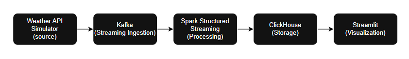

# 🌦 Weather Streaming Pipeline

## 📖 Project Purpose

This project was designed as a **portfolio-friendly streaming data pipeline** that demonstrates how real-time systems are built in modern data engineering. The theme is **weather events**, chosen because weather data is:
- Continuous and fast-changing → ideal for streaming
- Easy to simulate with fake APIs → no external dependency
- Intuitive to visualize → makes the demo engaging

The goal is to show how data flows from **ingestion → processing → storage → visualization** in a modular, containerized architecture.

---

## 🧪 Tech Stack

- **FastAPI** – simulate real-world APIs  
- **Apache Kafka** – distributed messaging backbone  
- **Apache Spark** – structured streaming for real-time ETL  
- **ClickHouse** – fast OLAP storage and queries  
- **Streamlit** – interactive visualization  
- **Docker Compose** – reproducible orchestration  

---

## 🏗️ Why These Tools?

- **FastAPI** (Fake Weather API)  
  - Lightweight Python web framework to simulate an external API  
  - Easy to generate structured JSON data (temperature, humidity, etc.)

- **Apache Kafka**  
  - Industry-standard distributed message broker  
  - Ensures reliable event ingestion and buffering  
  - At-least-once semantics for delivery

- **Apache Spark Structured Streaming**  
  - Scalable real-time processing engine  
  - Windowed aggregations (e.g., 5-minute average temperature per city)  
  - Checkpointing ensures fault-tolerant recovery

- **ClickHouse**  
  - High-performance OLAP database for time-series style data  
  - Supports fast queries and aggregations on large event streams  
  - `ReplacingMergeTree` handles duplicates gracefully

- **Streamlit**  
  - Quick and intuitive way to visualize real-time data  
  - Auto-refresh dashboard to show near-live updates  
  - Easy for demo and portfolio presentation

- **Docker Compose**  
  - Containerized deployment of the full stack  
  - Each service isolated but orchestrated together  
  - Reproducible environment for demo or interview

---

## ⚙️ Architecture



- FastAPI produces JSON weather events  
- Producer pushes events into Kafka topic (`weather.raw.v1`)  
- Spark job consumes topic, aggregates per city over 5-minute windows  
- Aggregated results stored in ClickHouse  
- Streamlit queries ClickHouse and visualizes metrics in real-time  

---

## 📂 Project Structure

```
.
├─ docker-compose.yml          # Orchestrates all services
├─ clickhouse/
│   └─ init.sql                # Database + table creation
├─ data/                       # Persistent checkpoints & logs (gitignored)
├─ src/
│   ├─ api_simulator/          # Fake weather API (FastAPI)
│   │   ├─ app.py
│   │   └─ Dockerfile.api
│   ├─ producer/               # Kafka producer pulling from API
│   │   ├─ push_from_api.py
│   │   └─ Dockerfile.producer
│   ├─ spark_jobs/             # Spark streaming job
│   │   ├─ stream_weather.py
│   │   └─ Dockerfile.spark-job
│   └─ streamlit_app/          # Streamlit visualization
│       ├─ app.py
│       └─ Dockerfile.streamlit
└─ README.md
```

---

## 🚀 Getting Started

### 1. Clone Repo
```bash
git clone https://github.com/TeKaiChou/weather-streaming.git
cd weather-streaming
```

### 2. Create Data Folder (for checkpoints)
```bash
mkdir -p data/spark-checkpoints
chmod -R 777 data
```

### 3. Start Services
```bash
docker compose up -d --build
```

This launches:
- FastAPI simulator → http://localhost:9001/weather  
- Kafka broker → localhost:9092 (internal: kafka:29092)  
- Spark master UI → http://localhost:8080  
- Spark worker UI → http://localhost:8081  
- ClickHouse HTTP → http://localhost:8123  
- Streamlit dashboard → http://localhost:8501  

### 4. Verify Pipeline
- Check API: `curl http://localhost:9001/weather`  
- Check Kafka topic `weather.raw.v1` via Kafka UI or CLI  
- Check ClickHouse table:
  ```bash
  docker exec -it <clickhouse_container> clickhouse-client     -q "SELECT * FROM weather.agg_5m_by_city ORDER BY window_start DESC LIMIT 10"
  ```
- Open Streamlit dashboard at http://localhost:8501  

### 5. Shutdown the service
```bash
docker compose down -v
```


---

## 📊 Example Dashboard

- City-level trends aggregated over 5-minute windows  
- Metrics: avg temperature, humidity, wind speed  
- Auto-refresh every 30 seconds for near real-time view  


---

## 🔑 Environment Variables

Defined inline in `docker-compose.yml`:

- **Producer**:
  - `KAFKA_BROKER=kafka:29092`
  - `RAW_TOPIC=weather.raw.v1`
  - `WEATHER_API=http://api-simulator:9001/weather`

- **Spark Job**:
  - `KAFKA_BOOTSTRAP=kafka:29092`
  - `CLICKHOUSE_HOST=clickhouse`
  - `CLICKHOUSE_PORT=8123`
  - `CLICKHOUSE_USER=default`
  - `CLICKHOUSE_PASSWORD=default_pw`
  - `CHECKPOINT_DIR=/tmp/spark-checkpoints/weather_agg`

---


## 📝 License
MIT
